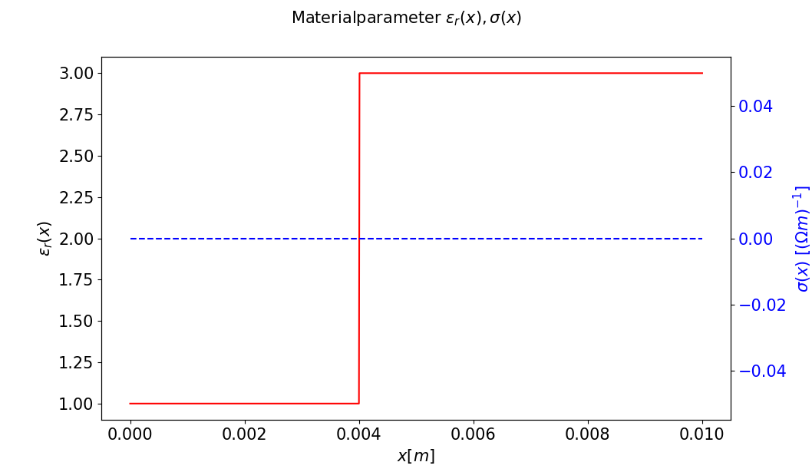
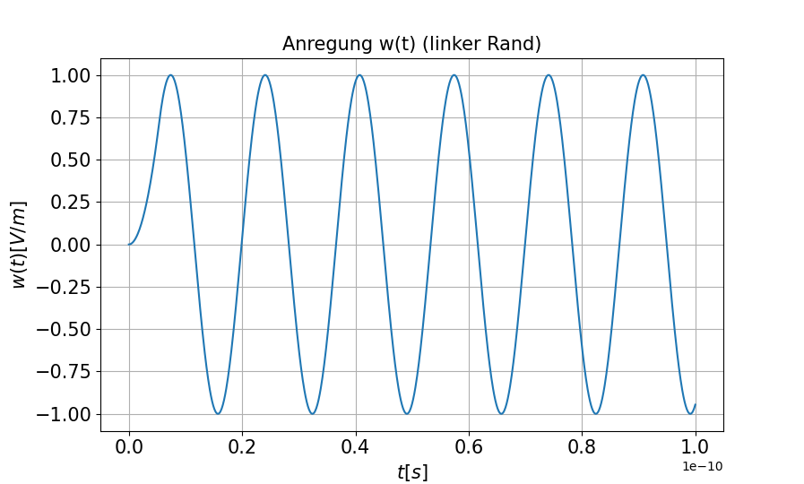
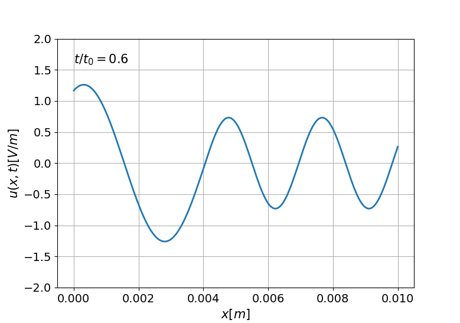
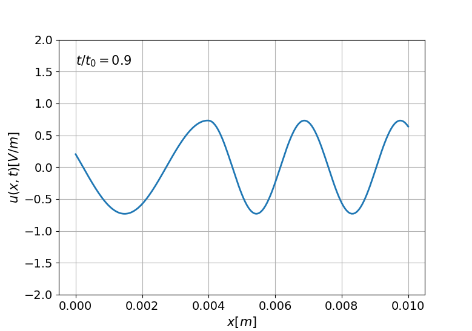

# FEM Simulation of a One-Dimensional Electromagnetic Wave

This project implements a Finite Element Method (FEM) simulation for analyzing the propagation of a one-dimensional electromagnetic wave in a inhomogeneous medium. 

## Features

Changes can be made in test.py

- Define material parameters: conductivity and permittivity over the domain.
- Choose Number of finite elements.
- Selectable order of the shape functions (e.g., quadratic functions).
- Choice of shape function types (Hierarchical, Lagrange).

## Getting Started

### Prerequisites

Ensure you have Python installed on your system. You will also need the following Python packages:
- NumPy
- Matplotlib

You can install the required packages using pip:

```bash
pip install numpy matplotlib
```

### Running the Simulation

You can change the parameters in test.py and run the simulation.
After running test.py, you will see two plots: one showing the material parameters and another showing the original wave.
After a short time (depending on the parameters such as the number of finite elements, the order of the shape functions, etc.), the animation of the numerical solution begins.








